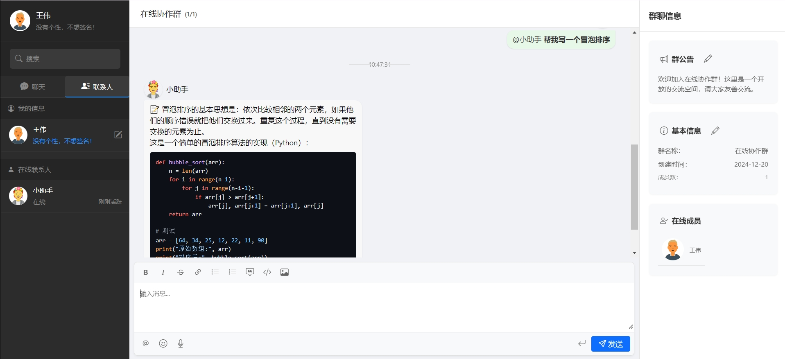
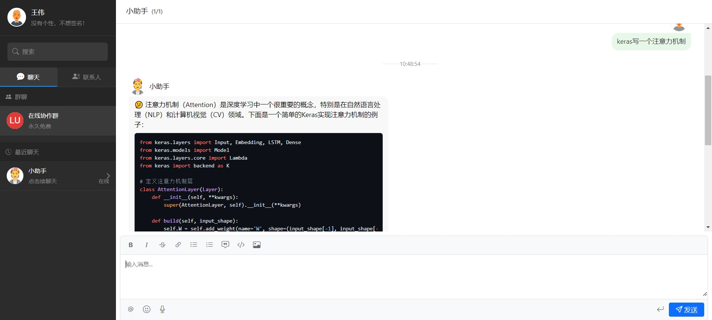

# Zero-shot Development of Chat Application Based on Cursor

## About Me
I am an algorithm engineer proficient in algorithms but have little knowledge of front-end and back-end development. This project is a zero-shot development chat application based on Cursor, utilizing Cursor's AI capabilities to quickly build a chat application. Throughout the process, I communicated with Cursor's COMPOSER agent, describing my ideas, and Cursor automatically generated and ran the code. I observed the results, and if unsatisfied, I communicated with Cursor again until my expectations were met.

## Project Structure
```
- AiChat/
  - frontend/
    - index.html
    - styles.css
    - server.py
  - backend/
    - main.py
    - requirements.txt
  - start.py
```

## Installation
```
conda create -n aichat python=3.12
conda activate aichat

cd AiChat/backend
pip install -r requirements.txt
```

### Modification
1. Modify `openai_api_key` and `openai_model_name` in **backend/main.py**

## Running
```
python start.py

Backend URL: http://localhost:8000
Frontend URL: http://localhost:5173
```

## Results
1. Login


2. Group Chat



3. Private Chat



## Summary
Currently, the application of large language models in the Code Copilot field has become one of the most widely practiced areas, such as Cursor, Windsurf, Cline, GitHub Copilot, MarsCoder, etc. Among them, Cursor is undoubtedly the most well-known product, so out of curiosity, I decided to use it to develop this project. Frankly, the project management capabilities of the Composer agent amazed me during use. I only needed to describe my ideas without writing the code myself (in fact, I am not good at front-end development). It can automatically create folders, generate files, fill in code, locate code segments, modify code, review code, and manage code blocks in multiple files simultaneously. In the terminal, it automatically fills in commands and starts services, and I only need to open the browser to see the final effect.

**The following details impressed me:**
1. Initially, I requested to use TypeScript, but encountered errors when installing npm-related dependencies. After multiple modifications, it still couldn't proceed. So I asked it to convert to Python, and it completed the conversion smoothly. However, there were still some unused project files at startup. I asked it to list all the current required files and delete the unnecessary ones, and it executed automatically.
2. In the project, I wanted the messages to support Markdown format, so I took screenshots of the required small components from other chat applications and uploaded them. It almost completed the design of all components according to the pictures, supporting image display, code block rendering, and other functions.
3. I wanted to integrate an AI chat assistant and told it I wanted to use OpenAI's interface, and it helped me complete this task. I only needed to fill in the OpenAI API key and model name, and after refreshing the page, I could successfully chat with the AI assistant.
4. Additionally, it added group chat @ function, message line break function, group chat announcement modification, group chat name and personal information editing, and other functions for me.
5. Supports historical message archiving and AI multi-round conversation.
6. ...

**Of course, there are also some shortcomings:**
1. When I asked to modify the personal information panel, it would modify the login information together, and after multiple attempts, it still couldn't be resolved.
2. I wanted to add language description and copy function for code blocks, but after modification, I couldn't successfully send messages containing code, and after multiple attempts, I had to choose to roll back.
3. I wanted to achieve synchronization of user avatars in multiple locations, but after refreshing and re-logging in, the avatars would appear inconsistent.
4. I wanted to add a user database, started deleting some previously created functions, but after multiple attempts, I couldn't successfully create it.
5. ...

Finally, I want to say that this was indeed a very interesting experience. Since my account has exhausted all the usage quota of the Premium model, the iteration has also stopped. If you are interested in this project, feel free to continue improving it.
