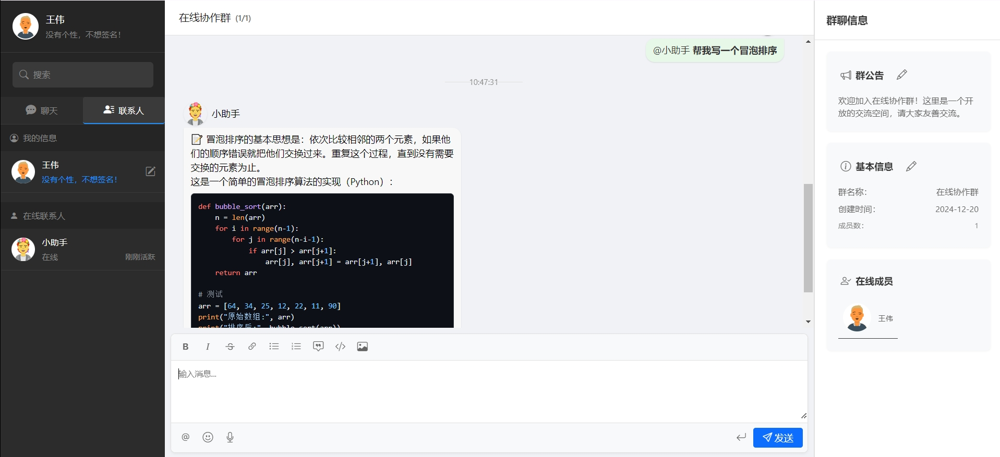

# 基于Cursor的零-shot开发聊天应用

## 关于我
我是一名算法工程师，精通算法，但对前后端开发知之甚少。本项目是基于Cursor的零-shot开发聊天应用，利用Cursor的AI能力，快速构建一个聊天应用。在整个过程中，我通过Cursor的COMPOSER代理功能与其对话，描述我的想法，Cursor则自动生成代码并运行。我观察效果，如果不满意，再次与Cursor沟通，直到达到我的期望。

## 项目结构
```
- AiChat/
  - frontend/
    - index.html
    - styles.css
    - server.py
  - backend/
    - main.py
    - requirements.txt
  - start.py
```

## 安装
```
conda create -n aichat python=3.12
conda activate aichat

cd AiChat/backend
pip install -r requirements.txt
```

### 修改
1. 修改**backend/main.py**中的```openai_api_key```和```openai_model_name```

## 运行
```
python start.py

后端地址: http://localhost:8000
前端地址: http://localhost:5173
```

## 效果
1. 登录


2. 群聊



3. 私聊


## 总结
当前，大语言模型在Code Copilot领域的应用已经成为最为广泛的实践之一，例如Cursor、Windsurf、Cline、GitHub Copilot、MarsCoder等。其中，Cursor无疑是最为人所知的产品，因此出于好奇，我决定使用它来开发这个项目。坦白说，Composer代理的项目管理能力在使用过程中令我感到惊艳。我只需描述我的想法，而无需亲自编写代码（实际上，我并不擅长前端开发）。它能够自动创建文件夹、生成文件、填充代码、定位代码段、修改代码、审核代码，并同时管理多个文件的代码块。在终端中，它自动填充命令并启动服务，我只需打开浏览器，便能看到最终效果。

**以下几点细节让我印象深刻：**
1. 起初，我要求使用TypeScript，但在安装npm相关依赖时遇到了错误，经过多次修改仍无法继续执行。于是我请求它转换为Python，它便顺利完成了转换。然而，启动时仍有一些不再使用的项目文件。我告诉它列出当前所有需要的文件，并删除那些不必要的，它便自动执行了。
2. 在项目中，我希望消息支持Markdown格式，因此我从其他聊天应用中截取了需要的小组件的截图，并上传给它。它几乎按照图片完成了所有组件的设计，并支持图片显示、代码块渲染等功能。
3. 我想接入一个AI聊天助手，告诉它我希望使用OpenAI的接口，它便帮助我完成了这一工作。我只需填写OpenAI的API密钥和模型名称，刷新网页后便能成功与AI聊天助手对话。
4. 此外，它还为我添加了群聊@功能、消息换行功能、群聊公告修改、群聊名称和个人信息的编辑等功能。
5. 支持历史消息存档和AI多轮会话。
6. ...

**当然，也有一些不足之处：**
1. 我要求修改个人信息面板时，它会连同登录信息一起修改，经过多次尝试仍未能解决。
2. 我希望添加代码块的语言描述和复制功能，但修改后无法成功发送包含代码的消息，经过多次尝试只好选择回退。
3. 我希望实现多位置用户头像的同步，但在刷新后重新登录时，头像会出现不一致的问题。
4. 我想添加一个用户数据库，开始删除之前创建的一些功能，但多次尝试未能成功创建。
5. ...

最后，我想说，这确实是一次非常有趣的体验。由于我的账号已用尽所有Premium模型的使用额度，迭代也因此停止。如果大家对此项目感兴趣，欢迎继续完善它。